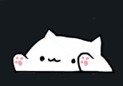

# bongocat-react

A React component that adds an animated BongoCat overlay to your app. The cat reacts to keyboard typing and mouse clicks in real-time.

<p align="center">
  
</p>

Built using [BongoCat-mac](https://github.com/Gamma-Software/BongoCat-mac) as reference (MIT licensed).

## Install

```bash
npm install bongocat-react
```

## Setup

1. Copy the 5 sprite PNGs into your public directory (e.g. `public/bongo-cat/`):
   - `base.png` — cat body
   - `left-up.png` / `left-down.png` — left paw states
   - `right-up.png` / `right-down.png` — right paw states

   You can find the original sprites in the `assets/` folder of this repo.

2. Add the component:

```tsx
import { BongoCat } from "bongocat-react";

function App() {
  return (
    <div>
      <BongoCat />
    </div>
  );
}
```

## Props

| Prop | Type | Default | Description |
|------|------|---------|-------------|
| `assetsPath` | `string` | `"/bongo-cat"` | Base URL path to sprite PNGs |
| `bottom` | `number \| string` | `16` | CSS bottom offset |
| `right` | `number \| string` | `16` | CSS right offset |
| `width` | `number` | `65` | Container width in px |
| `height` | `number` | `40` | Container height in px |
| `zIndex` | `number` | `9998` | z-index of the overlay |
| `pulse` | `boolean` | `true` | Scale pulse animation on input |
| `spriteMarginTop` | `string \| number` | `"37%"` | Margin-top on sprites to ground the cat visually |
| `clickTooltip` | `boolean` | `true` | Show a fun tooltip when the cat is clicked |
| `messages` | `string[]` | Built-in cat messages | Custom tooltip messages |
| `messageDuration` | `number` | `2000` | How long the tooltip stays visible (ms) |
| `className` | `string` | `""` | Additional CSS class |
| `style` | `CSSProperties` | — | Additional inline styles |

## Click Tooltip

Click on the cat and it'll say something fun! Enabled by default with 13 built-in messages. Customize with your own:

```tsx
{/* Use built-in messages (default) */}
<BongoCat />

{/* Custom messages */}
<BongoCat messages={["hire me!", "star this repo ⭐", "todo: take over world"]} />

{/* Disable tooltip */}
<BongoCat clickTooltip={false} />

{/* Longer display */}
<BongoCat messageDuration={5000} />
```

## Positioning

By default, the cat sits in the **bottom-right corner**. Use `bottom`, `right`, and `style` to place it wherever you want:

```tsx
{/* Bottom-right (default) */}
<BongoCat />

{/* Bottom-left */}
<BongoCat right="auto" style={{ left: 16 }} />

{/* Top-right */}
<BongoCat bottom="auto" style={{ top: 16 }} />

{/* Top-left */}
<BongoCat bottom="auto" right="auto" style={{ top: 16, left: 16 }} />

{/* Centered at bottom */}
<BongoCat right="auto" style={{ left: "50%", transform: "translateX(-50%)" }} />

{/* Custom offset */}
<BongoCat bottom={40} right={40} />

{/* Bigger cat */}
<BongoCat width={130} height={80} />
```

## Privacy

This package does not track, collect, or transmit any data. No analytics, no telemetry, no cookies. It's intentionally kept simple — just a lil kitty reacting to your keystrokes and clicks, entirely client-side.

## How it works

- Listens to `keydown`/`keyup` on `document` and `mousedown`/`mouseup` on `window` (capture phase)
- Maps physical key positions (`event.code`) to left/right paw — left-half keyboard keys move the left paw, right-half keys move the right paw
- Left mouse click → left paw, right click → right paw
- Click on the cat → random fun tooltip message
- Handles context menu stealing mouseup events

## Credits

- Built using [BongoCat-mac](https://github.com/Gamma-Software/BongoCat-mac) by Valentin Rudloff as reference — the sprite system and paw state machine were adapted from that project (MIT licensed)
- Original BongoCat meme by [@DitzyFlama](https://twitter.com/DitzyFlama), cat art by [@StrayRogue](https://twitter.com/StrayRogue)

## License

MIT
